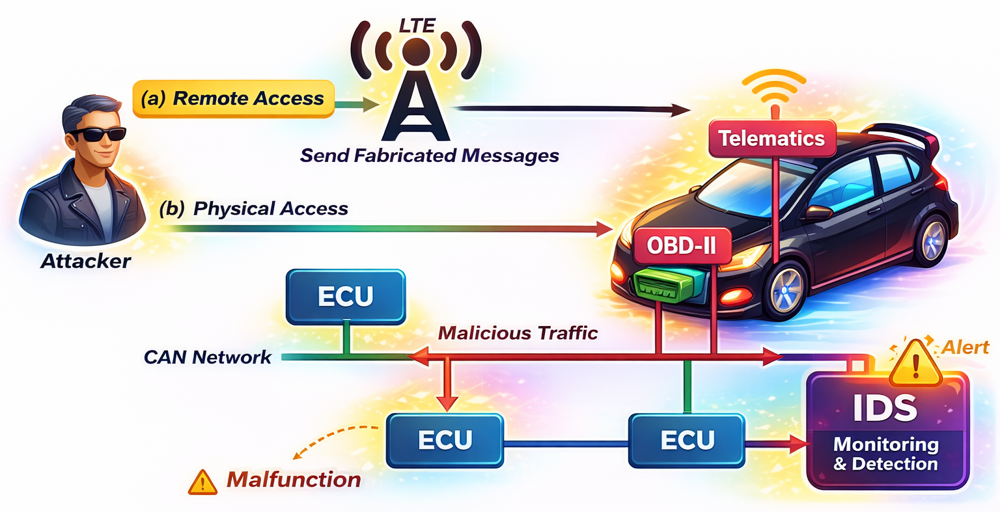
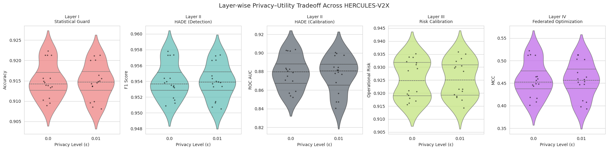

# 🚗 HERCULES-V2X PRO

## A Federated and Multi-Objective Intrusion Detection Framework for CAN-Based Autonomous Vehicle Networks

------------------------------------------------------------------------

## 📌 Overview

**HERCULES-V2X PRO** is a hierarchical four-layer intrusion detection
framework designed for secure CAN and V2X communication environments in
autonomous vehicles. It leverages architectural modifications for deep learning models to accommodate innovative solutions.  

Unlike conventional IDS systems that optimize only classification
accuracy, HERCULES-V2X PRO integrates:

-   Statistical deviation screening
-   Adaptive neural inference
-   Operational risk calibration
-   Federated distributed optimization
-   Privacy--utility tradeoff modeling
-   Multi-objective Pareto analysis

The complete research paper is included in this repository.

------------------------------------------------------------------------

# 🏗 Architecture Overview

### 🔹 Layer I --- Statistical Guard

Lightweight deviation filtering for early anomaly stabilization.

### 🔹 Layer II --- HADE (HERCULES Adaptive Decision Engine)

Neural probabilistic inference model.

### 🔹 Layer III --- Operational Risk Calibration

Deployment-aware threshold tuning without retraining.

### 🔹 Layer IV --- Distributed Federated Optimization

Privacy-aware collaborative parameter refinement.

------------------------------------------------------------------------

# 📊 Dataset

## Car Hacking: CAN Intrusion Detection Dataset

Source: Hacking and Countermeasure Research Lab (HCRL), Korea University

Includes: - Denial-of-Service (DoS) - Fuzzy/Flooding attacks - Benign
traffic

# 🏗 Dataset Overview

### Required Citations

Song, Hyun Min, et al. (2020).\
"In-vehicle network intrusion detection using deep convolutional neural
network."\
Vehicular Communications.

Seo, Eunbi, et al. (2018).\
"GIDS: GAN based Intrusion Detection System for In-Vehicle Network."\
IEEE PST.

------------------------------------------------------------------------

# 🔬 Methodology Summary

Each CAN frame:

mₜ = (identifier, payload, length, flag)

Converted into: - Deterministic encoded identifier\
- Normalized payload vector\
- Standardized feature vector

------------------------------------------------------------------------

## 🟢 Layer I --- Statistical Guard

sₜ = (1/d) Σ \|xₜⱼ\|\
gₜ(τ) = I(sₜ \> τ)

Complexity: O(d)

------------------------------------------------------------------------

## 🔵 Layer II --- HADE

h = ReLU(W₁x + b₁)\
p̂ = σ(W₂h + b₂)

Loss: Binary Cross Entropy

------------------------------------------------------------------------

## 🟣 Layer III --- Operational Risk Calibration

R(α, β; η) = αĉ(η) + βp̄

------------------------------------------------------------------------

## 🔴 Layer IV --- Federated Optimization

Θᵗ⁺¹ = (1/K) Σ Θᵏ\
Θᵏ ← Θᵏ + N(0, ε²)

------------------------------------------------------------------------

# 📈 Experimental Results

  Metric           Value
  ---------------- --------
  Accuracy         0.9223
  F1-score         0.9578
  ROC-AUC          0.9037
  MCC              0.5222
  Risk Objective   0.9359

Training time range: 299--327 seconds\
Total configurations evaluated: 32

------------------------------------------------------------------------

# 📊 Figures

 

<table>
<tr>
<td></td>
<td></td>
</tr>
<tr>
<td></td>
<td></td>
</tr>
<tr>
<td></td>
<td></td>
</tr>
<tr>
<td></td>
<td></td>
</tr>
<tr>
<td></td>
<td></td>
</tr>
</table>
------------------------------------------------------------------------

# 🧠 Novel Contributions

✔ Hierarchical 4-layer architecture\
✔ Federated distributed IDS training\
✔ Multi-objective optimization\
✔ Privacy--utility evaluation\
✔ Operational risk calibration

---

# 📊 HERCULES-V2X PRO: Detection & Risk Metrics

🟢 = Best observed  
🔴 = Lowest observed  

| Setting | Thr | Hid | Cl | ε | Accuracy | F1 | ROC | MCC | RiskObj | Train(s) |
|:--:|:--:|:--:|:--:|:--:|:--:|:--:|:--:|:--:|:--:|:--:|
| S9 | 2.0 | 64 | 2 | 0.00 | 🟢 **0.9223** | 🟢 **0.9578** | 0.9025 | 🟢 **0.5222** | 0.9156 | 304.56 |
| S29 | 2.5 | 64 | 2 | 0.00 | 0.9213 | 0.9573 | 🟢 **0.9037** | 0.5124 | 0.9294 | 320.74 |
| S24 | 2.5 | 32 | 4 | 0.01 | 🔴 0.9081 | 🔴 0.9505 | 0.8476 | 🔴 0.3935 | 0.9359 | 319.91 |
| S30 | 2.5 | 64 | 2 | 0.01 | 0.9213 | 0.9573 | 0.8996 | 0.5130 | 0.9297 | 🔴 **327.81** |

Full 32-configuration results available in paper.

---
---

# ⚙️ Efficiency, Privacy & Scalability Metrics

| Setting | Train(s) | Eff_Acc | Eff_F1 | ScalCoeff | DP-Loss | Final Acc |
|:--:|:--:|:--:|:--:|:--:|:--:|:--:|
| S11 | 🟢 **299.42** | 🟢 0.00305 | 🟢 0.00318 | 0.9908 | 0.0000 | 0.9138 |
| S9  | 304.56 | 0.00303 | 0.00315 | 1.0000 | 0.0000 | 🟢 **0.9223** |
| S30 | 🔴 **327.81** | 🔴 0.00281 | 🔴 0.00292 | 1.0000 | 0.0000 | 0.9213 |

Small perturbation (ε = 0.01) introduces minimal DP-Loss while maintaining > 0.91 accuracy across all settings.

---
---

# 📚 Comparison with Related Works

| Domain / Method | AV / CAN | Cross-Dataset | Multi-Objective |
|-----------------|:--------:|:-------------:|:---------------:|
| In-vehicle DL with knowledge graph | ✅ | ❌ | ❌ |
| Survey on ML IDS for CAVs | ✅ | ❌ | ❌ |
| Hybrid machine + deep learning IDS | ❌ | ❌ | ❌ |
| Deep IDS for Internet of Vehicles | ✅ | ❌ | ❌ |
| Signature IDS with fuzzy clustering | ❌ | ❌ | ❌ |
| Comprehensive IDS survey | ❌ | ❌ | ❌ |
| MLP-based automotive IDS deployment | ✅ | ❌ | ❌ |
| Quantum ML ID | ❌ | ❌ | ❌ |
| Malware security in autonomous vehicles | ✅ | ❌ | ❌ |
| IDS techniques and datasets survey | ❌ | ❌ | ❌ |
| IoT ID review | ❌ | ❌ | ❌ |
| Cyber risk analytics in IoT | ❌ | ❌ | ❌ |
| Privacy protection deep model | ❌ | ❌ | ❌ |
| IoT packet header IDS method | ❌ | ❌ | ❌ |
| Vehicular detection network (DL) | ✅ | ❌ | ❌ |
| Tracking detection framework | ❌ | ❌ | ❌ |
| Lightweight edge defense method | ❌ | ❌ | ❌ |
| CAV cybersecurity review | ✅ | ❌ | ❌ |
| Contrastive learning detection model | ❌ | ❌ | ❌ |
| Federated poisoning defense | ❌ | ❌ | ❌ |
| IoT SoC applications review | ❌ | ❌ | ❌ |
| Transformer model for autonomous driving | ✅ | ❌ | ❌ |
| V2X multimodal fusion model | ✅ | ❌ | ❌ |
| Attention-based vulnerability detection | ❌ | ❌ | ❌ |
| Network fuzzing framework | ❌ | ❌ | ❌ |
| Transfer learning malware defense | ❌ | ❌ | ❌ |
| Edge multimodal transformer framework | ✅ | ❌ | ❌ |
| **HERCULES-V2X PRO (Proposed)** | ✅ | ✅ | ✅ |

---

# 🧠 Layer-Wise Architectural Comparison

| Model | Accuracy | F1 | AUC | Stat Guard | Deep Rep | Risk Calib | Federated | Privacy |
|-------|:--:|:--:|:--:|:--:|:--:|:--:|:--:|:--:|
| k-NN (Song 2020) | 93.42% | 0.1236 | — | ❌ | ❌ | ❌ | ❌ | ❌ |
| Naïve Bayes | 90.98% | 0.9497 | — | ❌ | ❌ | ❌ | ❌ | ❌ |
| Decision Tree | 89.74% | 0.9163 | — | ❌ | ❌ | ❌ | ❌ | ❌ |
| GIDS (GAN) | 98.0% | — | 0.999 | ❌ | ✅ | ❌ | ❌ | ❌ |
| **HERCULES-V2X PRO** | **92.23%** | **0.9578** | **0.9037** | ✅ | ✅ | ✅ | ✅ | ✅ |

------------------------------------------------------------------------

# 📜 Citation

Khan, A., Khan, M. U., et al.\
HERCULES-V2X PRO: A Federated and Multi-Objective Intrusion Detection
Framework for CAN-Based Autonomous Vehicle Networks.

------------------------------------------------------------------------
