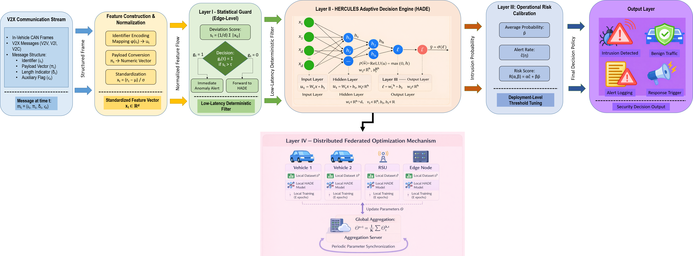
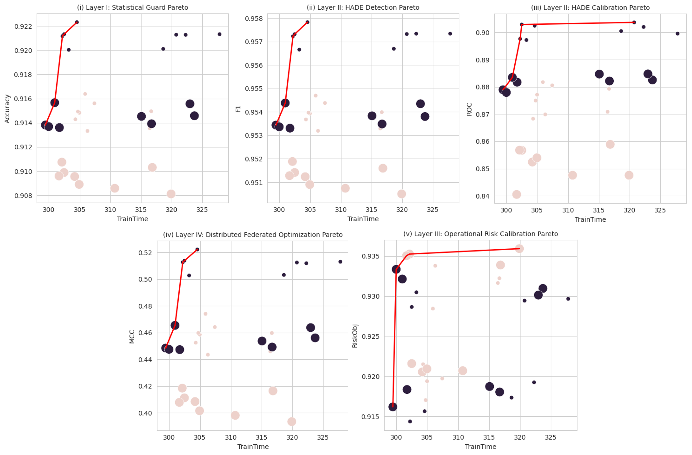
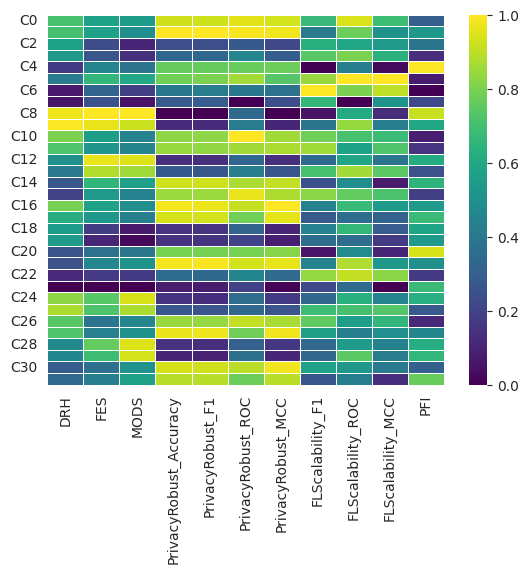

# 🚗 HERCULES-V2X PRO

## A Federated and Multi-Objective Intrusion Detection Framework for CAN-Based Autonomous Vehicle Networks

------------------------------------------------------------------------

## 📌 Overview

**HERCULES-V2X PRO** is a hierarchical four-layer intrusion detection
framework designed for secure CAN and V2X communication environments in
autonomous vehicles.

Unlike conventional IDS systems that optimize only classification
accuracy, HERCULES-V2X PRO integrates:

-   Statistical deviation screening\
-   Adaptive neural inference\
-   Operational risk calibration\
-   Federated distributed optimization\
-   Privacy--utility tradeoff modeling\
-   Multi-objective Pareto analysis

The complete research paper is included in this repository.

------------------------------------------------------------------------

# 🏗 Architecture Overview

### 🔹 Layer I --- Statistical Guard

Lightweight deviation filtering for early anomaly stabilization.

### 🔹 Layer II --- HADE (HERCULES Adaptive Decision Engine)

Neural probabilistic inference model.

### 🔹 Layer III --- Operational Risk Calibration

Deployment-aware threshold tuning without retraining.

### 🔹 Layer IV --- Distributed Federated Optimization

Privacy-aware collaborative parameter refinement.

------------------------------------------------------------------------

# 📊 Dataset

## Car Hacking: CAN Intrusion Detection Dataset

Source: Hacking and Countermeasure Research Lab (HCRL), Korea University

Includes: - Denial-of-Service (DoS) - Fuzzy/Flooding attacks - Benign
traffic

### Required Citations

Song, Hyun Min, et al. (2020).\
"In-vehicle network intrusion detection using deep convolutional neural
network."\
Vehicular Communications.

Seo, Eunbi, et al. (2018).\
"GIDS: GAN based Intrusion Detection System for In-Vehicle Network."\
IEEE PST.

------------------------------------------------------------------------

# 🔬 Methodology Summary

Each CAN frame:

mₜ = (identifier, payload, length, flag)

Converted into: - Deterministic encoded identifier\
- Normalized payload vector\
- Standardized feature vector

------------------------------------------------------------------------

## 🟢 Layer I --- Statistical Guard

sₜ = (1/d) Σ \|xₜⱼ\|\
gₜ(τ) = I(sₜ \> τ)

Complexity: O(d)

------------------------------------------------------------------------

## 🔵 Layer II --- HADE

h = ReLU(W₁x + b₁)\
p̂ = σ(W₂h + b₂)

Loss: Binary Cross Entropy

------------------------------------------------------------------------

## 🟣 Layer III --- Operational Risk Calibration

R(α, β; η) = αĉ(η) + βp̄

------------------------------------------------------------------------

## 🔴 Layer IV --- Federated Optimization

Θᵗ⁺¹ = (1/K) Σ Θᵏ\
Θᵏ ← Θᵏ + N(0, ε²)

------------------------------------------------------------------------

# 📈 Experimental Results

  Metric           Value
  ---------------- --------
  Accuracy         0.9223
  F1-score         0.9578
  ROC-AUC          0.9037
  MCC              0.5222
  Risk Objective   0.9359

Training time range: 299--327 seconds\
Total configurations evaluated: 32

------------------------------------------------------------------------

# 📊 Figures

 

<table>
<tr>
<td></td>
<td></td>
</tr>
<tr>
<td></td>
<td></td>
</tr>
<tr>
<td></td>
<td></td>
</tr>
<tr>
<td></td>
<td></td>
</tr>
<tr>
<td></td>
<td></td>
</tr>
</table>
------------------------------------------------------------------------

# 🧠 Novel Contributions

✔ Hierarchical 4-layer architecture\
✔ Federated distributed IDS training\
✔ Multi-objective optimization\
✔ Privacy--utility evaluation\
✔ Operational risk calibration

------------------------------------------------------------------------

# 📜 Citation

Khan, A., Khan, M. U., et al.\
HERCULES-V2X PRO: A Federated and Multi-Objective Intrusion Detection
Framework for CAN-Based Autonomous Vehicle Networks.

------------------------------------------------------------------------
